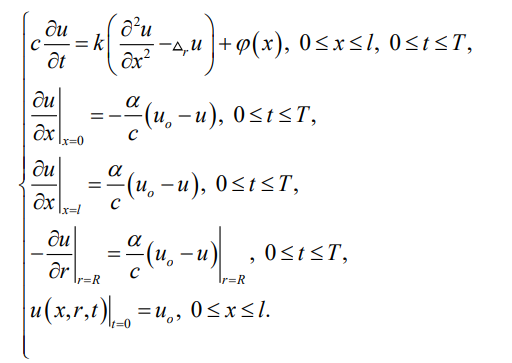
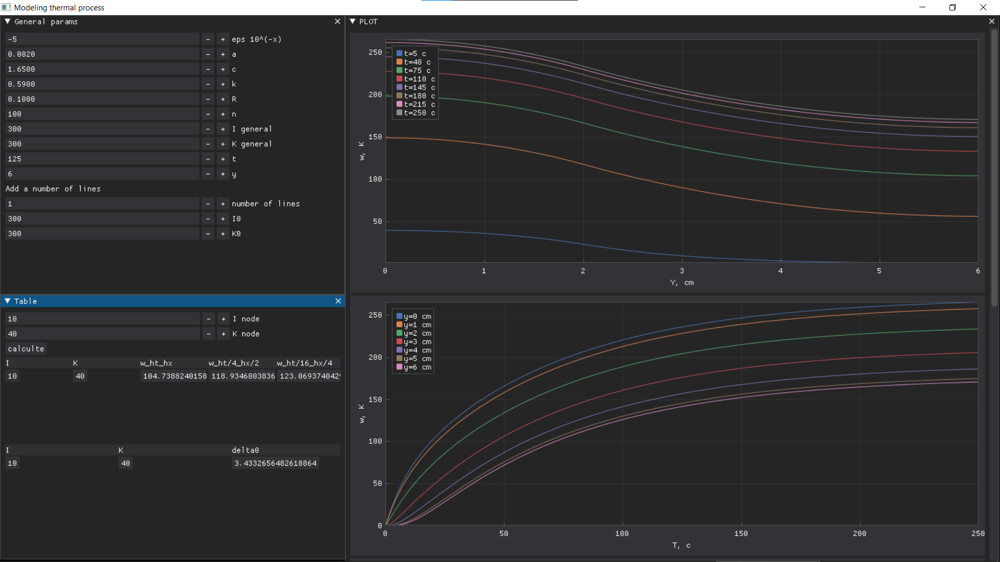
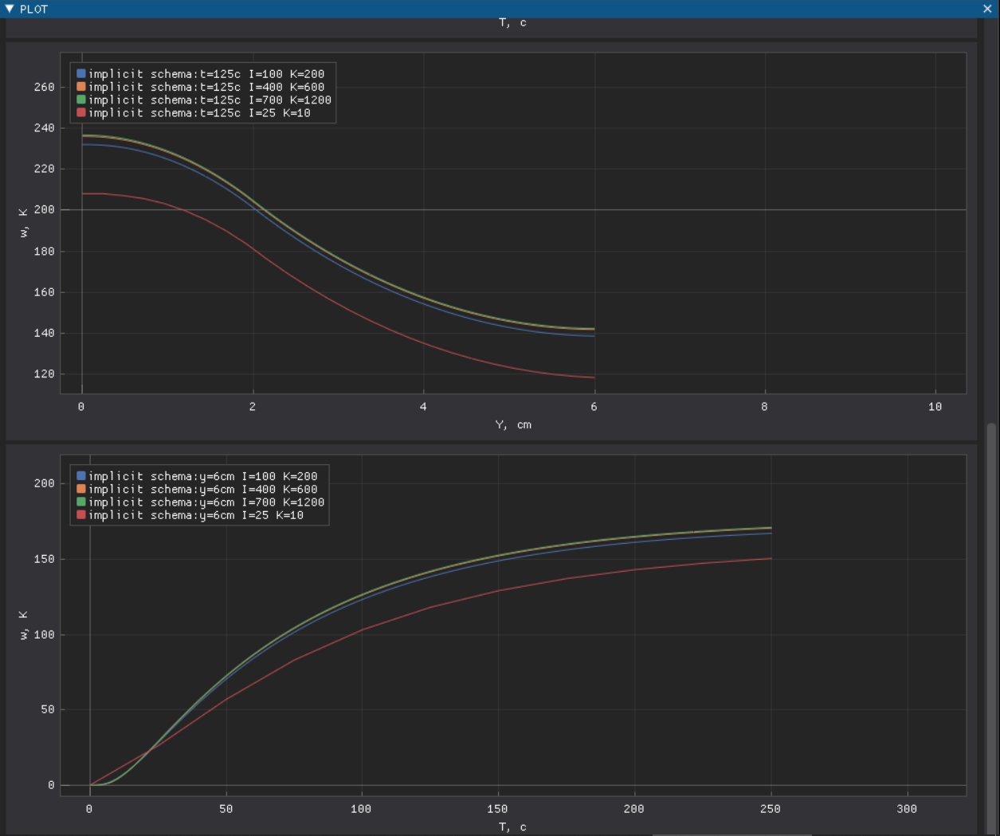

## Разработка приложения для вычисления теплопереноса в тонком стержневом проводнике.

В работе использовалось численное и аналитичекое решение системы:

# Программа предоставляет GUI с сравнением аналитического решения и сеточного.

# А также отрисование графиков сходимости сеточного решения.

# Начальные параметры системы:

| Param| Value    |         SI           |
| ---- | -------- | -------------------- |
|eps   |  0.00001 |                      |
|α     |  0.002   | Вт/(см^2*град)       |
|c     |  1.65    |  Дж/(cм^3*град)      |
|l     |  12      |  см                  |
|T     |  250     |  с                   |
|k     |  0.59    |  Вт/(см*град)        |
|R     |  0.1     |   см                 |

# Вычисления производятся через библиотеку numba с использованием компиляции jit.
Благодаря данной библиотеке, скорость вычисления позволяет динамически изменять параметры системы с разными размерами сеток.

